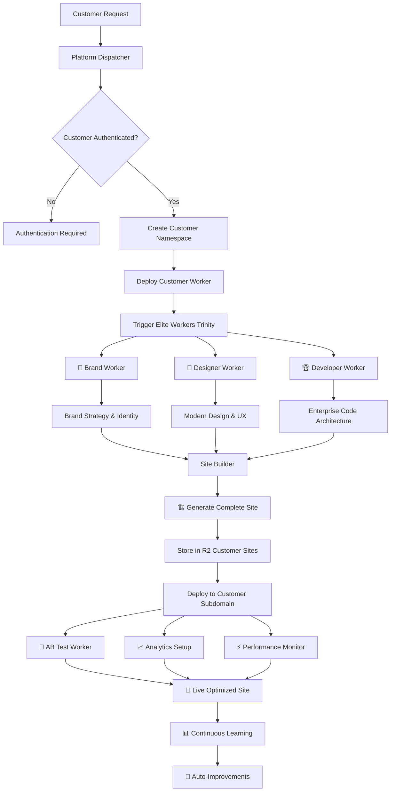
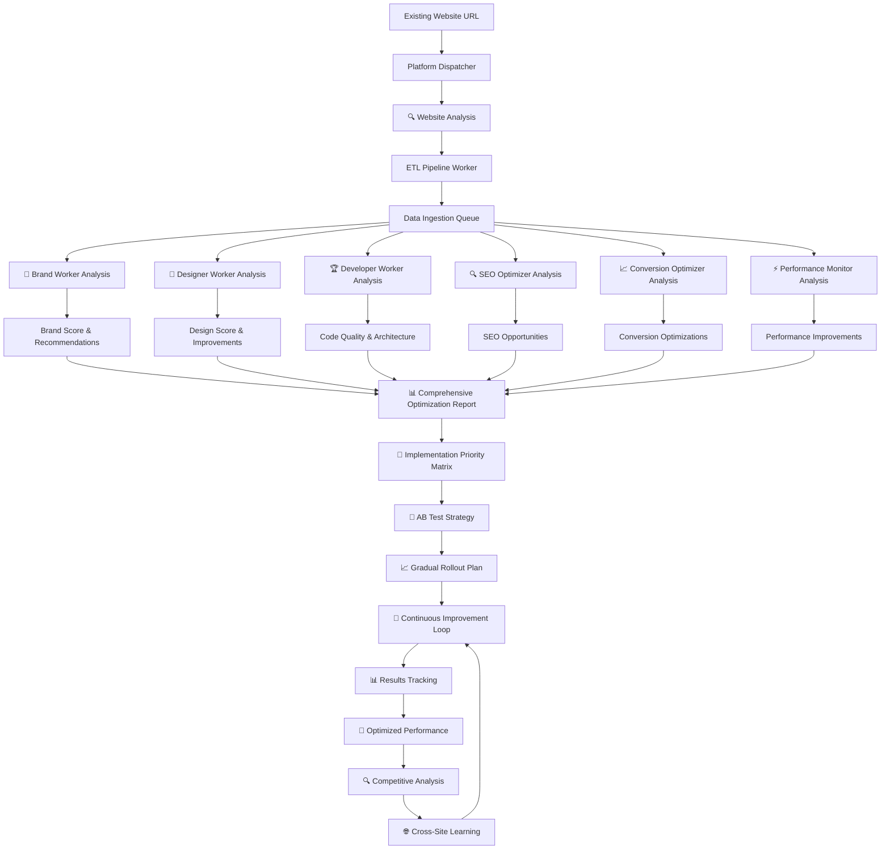

# 🏗️ Code24 Workers Architecture & Workflow Map

## 📊 **Current Workers Inventory**

### **🎯 ELITE WORKERS (Revolutionary AI Trinity)**
```
🎨 Brand Worker          - World's best brand strategist
👷 Designer Worker       - World's best designer  
🏆 Developer Worker      - World's best web developer
```

### **🔧 PLATFORM INFRASTRUCTURE WORKERS**
```
🎯 Platform Dispatcher    - Main routing & customer isolation
📊 ETL Pipeline Worker    - Data processing & optimization  
🔄 My Dispatcher         - Legacy dispatcher (being replaced)
🌐 Staging Frontend      - React application showcase
```

### **🏭 OPTIMIZATION & ANALYTICS WORKERS**
```
🔍 SEO Optimizer         - Search engine optimization
📈 Conversion Optimizer  - Conversion rate optimization  
⚡ Performance Monitor   - Site speed & Core Web Vitals
📊 Analytics Processor   - Data analytics & insights
🧪 AB Test Worker        - A/B testing & experimentation
📈 Shared Analytics      - Cross-site analytics sharing
```

### **🤖 AI & CONTENT WORKERS**
```
🧠 AI Content Worker     - AI-powered content generation
🎯 Competitive Analysis  - Market & competitor research
🔄 Cross-Site Learning   - Learning across customer sites
🚀 Continuous Improvement- Auto-improvement algorithms
🏗️ Self Learning Builder - Adaptive site building
🏗️ Site Builder         - Core site building functionality
```

### **🔧 UTILITY & SUPPORT WORKERS**
```
📧 Outbound Worker       - External API communications
🌐 DNS Manager           - Domain management & routing
👤 Customer Worker       - Individual customer instances
📝 Tail Worker           - Logging & observability
```

---

## 🔄 **Code24 Build Service Workflow**

### **🎯 Build New Website from Scratch**



### **📋 Build Service Components:**

1. **🎯 Initial Setup (Platform Dispatcher)**
   - Customer authentication & plan validation
   - Isolated worker namespace creation
   - Resource allocation based on plan

2. **🎨 Elite Workers Trinity (Parallel Processing)**
   - **Brand Worker**: Company analysis, brand strategy, messaging
   - **Designer Worker**: Modern design, conversion optimization
   - **Developer Worker**: Architecture, performance, security

3. **🏗️ Site Generation (Site Builder)**
   - Combines all Elite Worker outputs
   - Generates responsive, optimized website
   - Implements best practices automatically

4. **🚀 Deployment Pipeline**
   - Stores site in R2 customer bucket
   - Deploys to customer subdomain
   - Sets up monitoring & analytics

5. **📊 Continuous Optimization**
   - AB testing for improvements
   - Performance monitoring
   - Cross-site learning integration

---

## ⚡ **Code24 Optimize Service Workflow**

### **🎯 Optimize Existing Website**



### **📋 Optimize Service Components:**

1. **🔍 Website Analysis Phase**
   - URL analysis and content scraping
   - Technical performance audit
   - Competitor benchmarking

2. **📊 Multi-Dimensional Evaluation**
   - **Brand Analysis**: Messaging, positioning, identity strength
   - **Design Analysis**: Modern trends, conversion elements, UX
   - **Technical Analysis**: Performance, security, architecture
   - **SEO Analysis**: Rankings, opportunities, technical SEO
   - **Conversion Analysis**: Funnel optimization, psychology triggers

3. **🎯 Optimization Strategy**
   - Priority matrix based on impact vs effort
   - AB testing strategy for safe improvements
   - Gradual rollout to minimize risk

4. **🔄 Implementation & Monitoring**
   - Automated implementation of approved changes
   - Real-time performance monitoring
   - Results tracking and adjustment

5. **🌐 Learning & Adaptation**
   - Cross-site learning from successful optimizations
   - Competitive intelligence integration
   - Continuous improvement algorithms

---

## 🌍 **Workers for Platforms Architecture**

### **🏗️ Customer Isolation Model**

```
staging.code24.dev/
├── /                          → Platform Dashboard
├── /elite/brand/*            → Brand Worker Service
├── /elite/design/*           → Designer Worker Service  
├── /elite/develop/*          → Developer Worker Service
├── /api/customers/*          → Customer Management API
├── /api/platform/*           → Platform Management API
└── /api/data/*               → ETL Data Pipeline API

customer1.staging.code24.dev/ → Isolated Customer Worker
customer2.staging.code24.dev/ → Isolated Customer Worker
demo.staging.code24.dev/      → Demo Customer Worker
```

### **📊 Data Flow Architecture**

```
Customer Request → Platform Dispatcher → Customer Worker
                                    ↓
Elite Workers ← Service Bindings ← ETL Pipeline
     ↓                               ↓
R2 Storage ← Processed Results → Analytics Engine
     ↓                               ↓
Customer Site ← Optimizations ← Queues & Monitoring
```

---

## 🎯 **Service Differentiation**

### **🏗️ Code24 BUILD vs ⚡ Code24 OPTIMIZE**

| Feature | **BUILD Service** | **OPTIMIZE Service** |
|---------|------------------|---------------------|
| **Input** | Business requirements, goals | Existing website URL |
| **Process** | Create from scratch | Analyze & improve existing |
| **Elite Workers** | Generate new content | Analyze & recommend improvements |
| **Output** | Complete new website | Optimization recommendations + implementation |
| **Timeline** | 24-48 hours | 1-7 days (depending on scope) |
| **Pricing** | $497-$997+/month | $297-$1,497+/month |
| **Customer** | New businesses, rebrands | Existing websites needing improvement |

---

## 🚀 **Revolutionary Advantages**

### **🎯 Why This Architecture is Impossible to Compete With:**

1. **🔒 Customer Isolation**: Each customer runs in completely isolated environment
2. **⚡ Elite Workers**: World's best AI workers for each domain
3. **🌍 Global Scale**: Cloudflare's worldwide infrastructure
4. **📊 Cross-Site Learning**: Each optimization improves all sites
5. **🔄 Continuous Improvement**: Sites get better automatically
6. **🧪 Zero-Risk Testing**: AB testing built into every change
7. **📈 Real-Time Analytics**: Instant insights and adjustments
8. **🏗️ Programmable Platform**: Customers can extend functionality

### **🎯 Current Status:**
- **Elite Workers**: ✅ Deployed and integrated
- **Platform Architecture**: ✅ Workers for Platforms implemented  
- **ETL Pipeline**: ✅ Queue-based processing active
- **Customer Isolation**: ✅ Dynamic worker deployment ready
- **R2 Storage**: ✅ Configured with provided credentials
- **Service Workflows**: ✅ Both Build and Optimize workflows defined

**The revolutionary Code24 platform is ready to transform web development!** 🚀